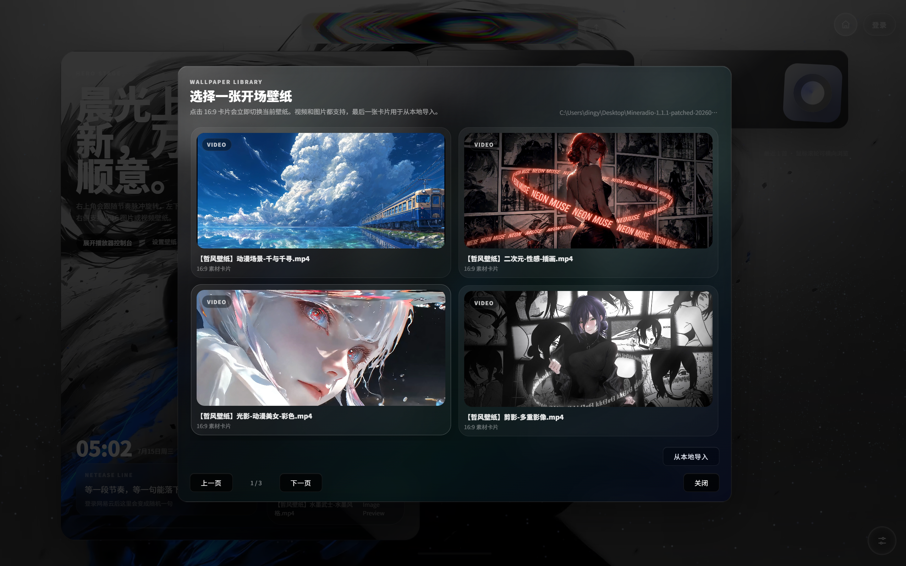

# Mineradio

界面展示名：`Jike radio`

Mineradio 是一款 Windows 端可视化动态壁纸音乐播放器，主打多平台音乐账号互通、桌面歌词、粒子特效与视频动态壁纸联动。

它不只是一个播放器，也是一座视觉舞台。你可以把它当作普通音乐播放器使用，也可以把它当作桌面美化与沉浸式听歌工具来使用。

## 核心特性

- 多平台音乐账号互通，支持网易云音乐、QQ 音乐、酷狗音乐登录与同步
- 动态壁纸与音乐联动，支持本地导入图片或视频素材
- 桌面歌词、粒子特效、歌单架、播放控制台组成完整视觉舞台
- DIY 玩家模式，提供更完整的视觉与播放调节能力
- 支持系统托盘、全局快捷键、单实例唤起、更新面板等桌面集成功能

## 界面预览

### 启动欢迎页

启动后首先进入欢迎页，展示 `Jike radio` 的品牌视觉和 `PRIVATE VISUAL RADIO` 定位文案。点击“点击进入”即可进入主界面。

### 多平台登录弹窗

支持网易云音乐、QQ 音乐、酷狗音乐、汽水音乐入口切换。用户可以扫码登录对应平台，同步歌单、红心、播客等内容；不登录时也可以直接搜索歌曲试听。

### 壁纸素材库

内置多组 16:9 图片与视频壁纸素材，支持分页浏览，也支持从本地导入 MP4 视频作为动态桌面背景。

### 完整播放桌面效果

完整播放桌面由四层组成：

1. 底层动态壁纸
2. 居中歌词与粒子特效
3. 右侧悬浮歌单架
4. 底部全局播放控制台

## 使用体验

- 启动后可直接进入主界面
- 无需登录也可以先搜索歌曲试听
- 登录后可同步多平台音乐库数据
- 壁纸、歌词、粒子与音乐节拍联动
- 可自由切换内置壁纸或导入本地素材

## 当前版本

- 版本：`v1.1.1`
- 发布包：`release/Jikeradio-v1.1.1-portable-win64.zip`
- 类型：Windows 便携版

## 说明

- 当前为 Windows 便携版，不是 NSIS 安装版
- 更新元数据已指向 `dingyuanyuan1100-bot/jikeradio`
- 汽水音乐当前为界面入口预留，暂未完整接通
- 壁纸模式与桌面歌词属于 Windows 桌面环境功能
